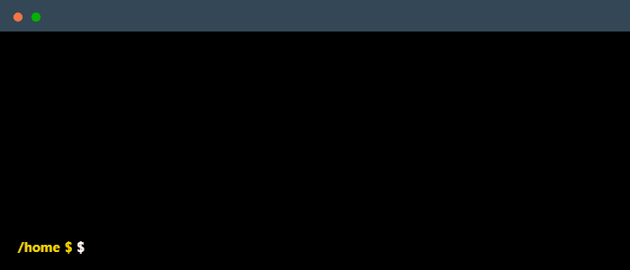

<!--
    Hey there! Happy you stopped by.
    Feel free to take inspiration — and maybe follow while you're here 😄
    Let's connect on LinkedIn @ethan-bwibo!
-->

<!--
    Terminal GIF showing a quick "about me" in CLI style.
    Create yours at https://www.terminalgif.com
-->

    

### Main skills

### Currently learning

### GitHub Stats

&nbsp;&nbsp;

&nbsp;&nbsp;

### Connect with me!

    
    &nbsp;
    
    &nbsp;
    

### Employer?
> [!IMPORTANT]
> <a href="https://ethan-bwibo.vercel.app/" target="_blank">View my Portfolio</a> &nbsp;|&nbsp; <a href="mailto:enbwibo@gmail.com">Get in touch</a>

<!--
    Thanks for visiting! ✨
-->
